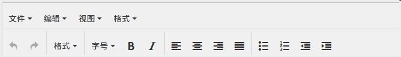
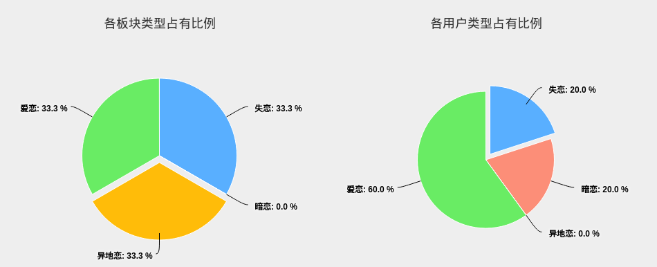

# MissLove 恋爱博物馆

***
## 项目简介
MissLove的灵感来源是克罗地亚的失恋博物馆，一个陈列失恋物品的实体博物馆。而MissLove是一个线上的爱情博物馆，这里成列的是任何和爱情相关的爱情故事。

博物馆分为**四个主题馆**，分别是失恋、暗恋、异地恋和爱恋。失恋、暗恋、异地恋馆分别成列相应类型的爱情故事，而非此三类型的其他任何爱情故事，可以陈列在爱恋馆。

## 项目特色

- **富文本编辑**
实现了富文本编辑，用户可以非常方便地实现各种样式的文本编辑。

- **恋爱类型统计**
在首页底部，有四个主题馆发表文章文章数目的统计，和注册本网站用户的恋爱类型的统计，实时了解各恋爱类型的比例。

- **设计风格文艺唯美**
网站整体设计风格统一，唯美文艺而安详，给进馆参观的游客以及用户一个舒心宁静的环境。

- **无交友圈模式**
本网站是无交友圈模式，即用户之间没有相互关注，不会形成关系链。但是用户可以在故事下方发表评论。采用无交友圈模式出于以下两方面考虑：爱情是一个敏感话题，无交友圈模式可以充分保护用户隐私；本网站旨在构建纯粹爱情故事陈列环境，就如参观博物馆一样，认真了解每一个展品背后的故事并记在心中便好。

## 项目部署
本项目部署在新浪云平台。访问网址：http://lovemuseum.sinaapp.com/

## 开发技术版本

**Python:2.7
django：1.84
bootstrap:3.3**